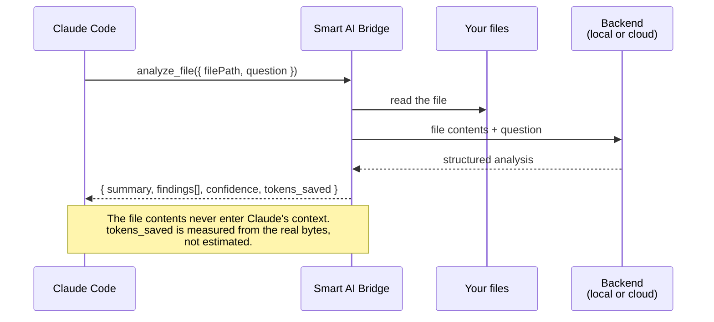
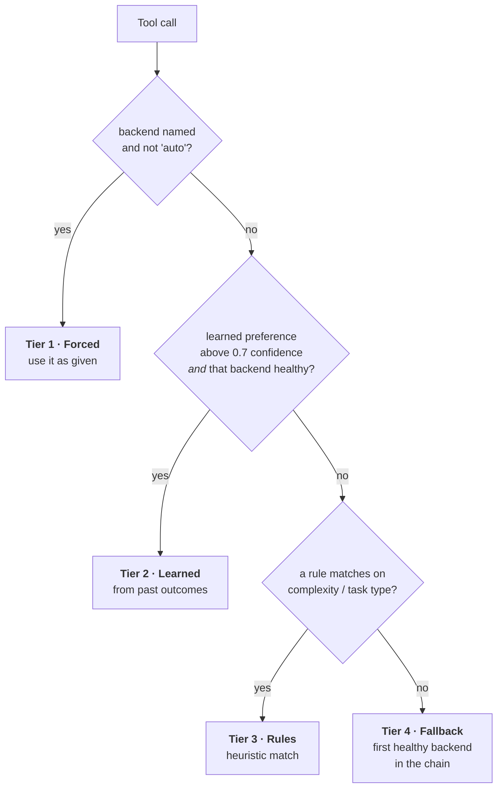
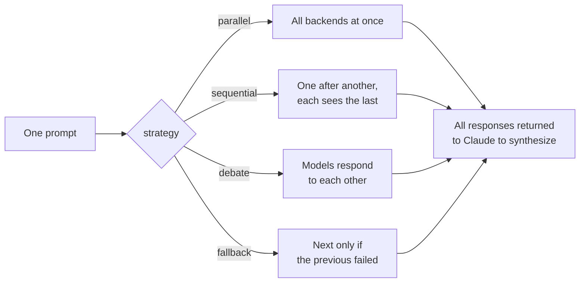

# Smart AI Bridge v2.14.0

<a href="https://glama.ai/mcp/servers/@Platano78/Smart-AI-Bridge">
  
</a>

**Config-driven multi-AI orchestration for Claude Code. Add any OpenAI-compatible provider, route intelligently, and let multiple AIs collaborate through the council system.**

## What It Does

Smart AI Bridge is an MCP server that sits between Claude Code and your AI backends. It provides 17 tools for token-saving file operations, multi-AI workflows, code quality checks, and intelligent routing -- all configured through a single JSON file.

- **Any OpenAI-compatible provider works.** Local models (vLLM, LM Studio, Ollama), cloud APIs, or a mix of both. The included presets cover common providers, but adding your own is just a config entry.
- **Smart routing** selects the best backend per task using a 4-tier system: forced selection, learned preferences, rule-based heuristics, and health-based fallback.
- **Council system** queries multiple backends on the same prompt and returns all responses for Claude to synthesize. Configurable strategies (parallel, sequential, debate, fallback) per topic.
- **Web dashboard** for managing backends and council configuration without editing JSON files.

## How It Works


### The core idea: Claude never reads the file

Most of Claude's context on a coding task is spent on file contents. Smart AI Bridge hands
that work to another model and returns only the conclusions, so the expensive context stays
free for reasoning.



`modify_file` works the same way but returns a diff; `explore` returns matching `file:line`
evidence; `batch_analyze` does it across a glob. Every one of these reports a `tokens_saved`
figure computed from the actual characters read versus the actual response returned.

### Choosing a backend: the 4-tier router

Every call that doesn't name a backend goes through the same decision, in order. The first
tier that produces a healthy backend wins.



A learned preference that is confident but points at an *unhealthy* backend falls through to
Tier 3 rather than being used. Health failures open a circuit breaker, so a provider that is
down is skipped rather than retried into a timeout.

### Asking several models at once: the council

`council` sends one prompt to multiple backends and returns every response for Claude to
synthesize. It does not vote or pick a winner — disagreement between models is the signal,
so it is preserved rather than averaged away.



Strategy is configurable per topic. See [docs/COUNCIL.md](docs/COUNCIL.md).

## Quick Start

There is no npm package -- install by cloning. Requires **Node.js >= 18**.

### 1. Clone and install

```bash
git clone https://github.com/Platano78/smart-ai-bridge.git
cd smart-ai-bridge
npm install
```

Confirm the install is sound before wiring it into anything:

```bash
npm test          # expect: all tests pass, 0 failures
```

### 2. Configure at least one backend

The server **starts and lists all 17 tools with no API keys at all** -- you only need a
backend when you actually call one. You need one of:

- **a local OpenAI-compatible server** (llama.cpp, vLLM, LM Studio, Ollama) -- auto-discovered on
  common ports, no key required; or
- **one cloud API key** from any supported provider.

```bash
# Set whichever apply -- one is enough
export NVIDIA_API_KEY="your-key"
export OPENAI_API_KEY="your-key"
export GEMINI_API_KEY="your-key"
export GROQ_API_KEY="your-key"
```

Backend definitions live in `src/config/backends.json`; see [CONFIGURATION.md](CONFIGURATION.md)
for the full reference. A missing key is never an error -- the startup readiness audit reports
such backends as `cannot verify`, not as broken.

### 3. Register with your MCP client

Use an **absolute path** to `src/server.js`. Relative paths depend on the client honoring `cwd`,
which not every client does.

**Claude Code** -- copy [`.mcp.json.example`](.mcp.json.example) to `.mcp.json` in your project,
or add to your MCP settings:

```json
{
  "mcpServers": {
    "smart-ai-bridge": {
      "command": "node",
      "args": ["/absolute/path/to/smart-ai-bridge/src/server.js"],
      "env": {
        "NVIDIA_API_KEY": "your-key"
      }
    }
  }
}
```

**Claude Desktop** -- same block, merged into `claude_desktop_config.json`:

- macOS: `~/Library/Application Support/Claude/claude_desktop_config.json`
- Windows: `%APPDATA%\Claude\claude_desktop_config.json`

**Any other MCP client** -- it speaks MCP over stdio. Run `node /absolute/path/src/server.js` and
talk JSON-RPC to it. Diagnostics go to stderr; stdout carries protocol traffic only.

### 4. Restart the client and verify

All 17 tools appear after a restart. Verify with a call that needs **no** backend:

```
@get_analytics({})
```

To check a backend you have actually configured, name it explicitly -- `check_backend_health`
reports `local` as critical when no local model is running, which is expected on a cloud-only
setup and does not mean the install failed:

```
@check_backend_health({ "backend": "auto" })
```

### Updating an existing install

```bash
cd /path/to/smart-ai-bridge
git pull origin main
npm install        # only needed when dependencies changed
```

Then restart your MCP client (in Claude Code, `/mcp` reconnects without a full restart).

## Tools (17)

### Token-Saving File Operations

| Tool | Description |
|------|-------------|
| `analyze_file` | Backend reads and analyzes files, returns structured findings |
| `modify_file` | Backend applies natural-language edits, returns diff |
| `batch_analyze` | Analyze multiple files via glob patterns; `grepFilter` narrows by content first, `singlePass` answers in one call |
| `batch_modify` | Apply same instructions across multiple files |
| `generate_file` | Generate code from a natural-language spec |
| `explore` | Answer codebase questions using intelligent search |

All but `generate_file` return a `tokens_saved` field measured for that specific call: the
characters of file content the backend read on your behalf, minus the characters of the
response handed back. Both sides are measured from the real data rather than assumed, so
the figure reflects what actually happened on that call -- though the character-to-token
conversion (~4 characters per token) is itself approximate, so treat the result as a good
indicator rather than an exact token count. It varies enormously with file size and
response length: a small file can save nothing at all. We publish no headline percentage
because we have not benchmarked one we could defend.

### Multi-AI Workflows

| Tool | Description |
|------|-------------|
| `ask` | Smart routing with auto or forced backend selection |
| `council` | Multi-AI consensus across configurable backends |
| `dual_iterate` | Generate, review, fix loop between two backends |
| `parallel_agents` | TDD workflow with decomposition and quality gates |
| `spawn_subagent` | Specialized AI agents (10 roles including TDD) |

### Code Quality

| Tool | Description |
|------|-------------|
| `review` | Security, performance, and quality review |
| `refactor` | Cross-file refactoring with reference updates |

### Infrastructure

| Tool | Description |
|------|-------------|
| `check_backend_health` | Health diagnostics for specific backends |
| `backup_restore` | Timestamped backup management |
| `write_files_atomic` | Atomic multi-file writes with backup |
| `get_analytics` | Usage analytics and optimization recommendations |

## Smart Routing

The router selects backends using a 4-tier priority system:

1. **Forced** -- explicit backend selection (`model="my_backend"`)
2. **Learning** -- learned preferences from past outcomes (>0.7 confidence)
3. **Rules** -- complexity and task-type heuristics
4. **Fallback** -- health-based fallback through the priority chain

When a backend fails, requests automatically fall to the next healthy backend. Circuit breakers protect each backend (5 consecutive failures trigger a 30-second cooldown).

### Backend Names

There are two layers of backend naming, and both are intentional:

- **Friendly names** are what you pass to tools (e.g. `backend: "glm"` or
  `model="groq"`). They are stable, provider-neutral aliases.
- **Internal names** are the registry/config identifiers used in
  `src/config/backends.json` and analytics.

The presets map as follows:

| Friendly name | Internal name | Adapter type |
|---------------|---------------|--------------|
| `local` | `local` | `local` |
| `deepseek` | `nvidia_deepseek` | `nvidia_deepseek` |
| `glm` | `nvidia_glm` | `nvidia_glm` |
| `gemini` | `gemini` | `gemini` |
| `groq` | `groq_llama` | `groq` |

**Removed: `nvidia_qwen` / `qwen3`.** The NVIDIA code-specialist lane once served a Qwen
model. NVIDIA has since retired it, and its catalog now lists **no Qwen model of any
kind** — so the names were removed outright rather than kept as aliases pointing at a
differently-named lane. `nvidia_qwen` and `qwen3` no longer resolve to anything.

Use `nvidia_glm` (friendly alias: `glm`). If you have a saved `force_backend:
"nvidia_qwen"` or a config carrying `"type": "nvidia_qwen"`, change it to `nvidia_glm`.

This does not affect Qwen models you run **locally**. The bridge still detects them on
your own router and applies Qwen-specific handling (capability inference, FIM tokens,
reasoning-suppression) — that has nothing to do with the retired NVIDIA lane.

The OpenAI-compatible backend ships under the internal name `openai_chatgpt` (adapter
type `openai`) and is reached through smart routing rather than a friendly alias. For the
`ask` tool, `openai` is accepted as a compatibility alias for the configured
OpenAI-compatible backend. Custom backends you add via config use their `name` field
directly as the internal name.

### Backend Drift and Model Retirement

Providers retire models without notice, and the failure is otherwise silent until a
request fails. Two things catch that:

**A readiness audit at startup.** It checks each configured backend's model against the
provider's catalog and prints findings to stderr. It runs only *after* the MCP handshake
completes and is never awaited, so it cannot delay or abort startup. Disable it with
`SAB_DISABLE_READINESS_AUDIT=true`.

**An on-demand probe** that sends every configured backend a real completion:

```bash
npm run audit:backends            # human-readable table
npm run audit:backends -- --json  # machine-readable
```

A real completion is the only trustworthy check — model ids appear in a provider's
`/v1/models` listing that still return 404 for a given account. Backends are classified
`OK`, `RETIRED`, `TRANSIENT`, `ERROR`, `NO_MODEL`, or `NO_KEY`. It exits non-zero only on
`RETIRED`, `ERROR`, or `NO_MODEL`, so it can gate CI.

**A backend with no API key is never reported as broken.** You supply your own keys and
most setups configure a single provider, so an unset key reports as
`cannot verify — <VAR> not set` and does not fail the run. The `local` backend is
reachability-checked only, never catalog-checked: its configured `"model": "dynamic"` is
a handle, not a catalog id.

When a model *has* been retired, the resulting error says so explicitly — naming the
backend, the model, the provider's end-of-life text, and live replacement candidates —
rather than surfacing as a generic HTTP failure. Retirement is a configuration error, so
it opens the circuit breaker immediately instead of being retried; saturation (429/5xx)
and auth failures (401) are deliberately not treated as retirement.

### Response Reliability (v2.4.0)

All handlers use a unified response pipeline (`extractResponseText`) that correctly handles every known LLM response shape -- raw strings, OpenAI chat/completion formats, thinking model `reasoning_content`, array content parts, and Gemini candidates. Repetitive output from local models is automatically collapsed, and analysis findings are deduplicated and capped.

### Write Integrity

`fs.writeFile` resolving does not guarantee the bytes on disk match what was requested -- short or partial writes, `ENOSPC`, encoding mangling, or a concurrent writer clobbering the file between write and return all leave disk content that diverges from the intended content while the write call itself resolves cleanly.

Every path that writes content you care about reads it back and compares before reporting success:

| Path | What is verified |
|------|------------------|
| `modify_file` auto-write | modified file, plus the backup it takes first |
| `generate_file` auto-write | generated file and its generated tests file |
| `write_files_atomic` `write` | each written file, plus each backup |
| `write_files_atomic` `append` | file grew by exactly the appended length and ends with exactly those bytes |
| `write_files_atomic` rollback | each restored file (the backup is only unlinked once the restore is confirmed) |
| `batch_modify` | modifications (via `modify_file`) and its rollback restores |
| `parallel_agents` | each generated code file |
| `backup_restore` | the backup, the pre-restore snapshot, and the restore itself |

A mismatch raises `WRITE_VERIFY_MISMATCH` -- naming the file, the expected vs actual length, and the first divergent line -- instead of reporting `success: true` over a corrupted file.

Recovery paths get the same treatment deliberately: a backup that silently failed to land is worse than no backup, because a later rollback would restore corrupt bytes over the original.

Not verified, by design: internal run artifacts and state files that are records rather than deliverables -- `parallel_agents`' `decomposed.json`/`results.json`/`quality-*.json`/`synthesis.json`, `backup_restore`'s `.meta.json` sidecar, the pattern store, and conversation threads.

## Council System

The council queries multiple backends on the same prompt and returns all responses for Claude to synthesize. Topics like `coding`, `architecture`, and `security` each map to a set of backends and a strategy (parallel, sequential, debate, or fallback).

See [docs/COUNCIL.md](docs/COUNCIL.md) for full documentation.

## Dashboard

An optional web dashboard provides UI for backend management (enable/disable, priorities, health checks) and council configuration (strategies, topic mapping).

See [docs/DASHBOARD.md](docs/DASHBOARD.md) for setup and API reference.

## SmartCrusher (Tool-Result Compression)

Large tool results — long file analyses, council responses, batch outputs — can fill Claude's context window quickly. SmartCrusher trims oversized arrays before serialization using a salience-weighted keep/drop strategy, inserting a sentinel row so Claude knows data was offloaded.

**Disabled by default.** Enable only after running the fidelity eval against your own local model.

### Enable

```bash
# One-time env override (no config edit needed)
SAB_COMPRESSION_ENABLED=true node src/server.js

# Or permanently in src/config/backends.json:
# "compression": { "enabled": true }
```

### Fidelity Eval (run before enabling)

The eval probes whether crushed responses preserve factual accuracy compared to originals. It requires an OpenAI-compatible local API — use whatever model you normally run:

```bash
RUN_CRUSH_EVAL=1 \
  CRUSH_EVAL_BASE_URL=http://127.0.0.1:<port>/v1 \
  CRUSH_EVAL_MODEL=<your-model-id> \
  npx vitest run tests/compression/probeFidelity.test.js
```

Check the output for `original=N/15` vs `crushed=M/15` per dimension. If crushed scores drop more than 2 points on any dimension, leave compression disabled — the model grades differently than the reference setup.

## Adding a Backend

**Via Dashboard** (recommended): Start the server with `SAB_DASHBOARD=true`, then use the web UI at `http://localhost:3456` (override with `SAB_DASHBOARD_PORT`) to add, remove, enable/disable, and re-prioritize backends without editing JSON. The dashboard also lets you set/clear an API key per backend (stored in the gitignored `data/backends-secrets.json`, mode `0600` — never written to the tracked `src/config/backends.json`); a stored key takes effect immediately, no restart required, and beats the backend's `process.env` fallback.

The dashboard binds to `127.0.0.1` only by default — it has no authentication, so it must not be reachable off-box. Override with `SAB_DASHBOARD_HOST` if you need it reachable elsewhere; a non-loopback host prints a warning on startup naming the risk.

**Via Config File**: Any OpenAI-compatible provider can be added as a config entry in `src/config/backends.json`:

```json
{
  "name": "my_provider",
  "type": "openai",
  "endpoint": "https://api.my-provider.com/v1",
  "model": "my-model",
  "apiKeyEnvVar": "MY_PROVIDER_API_KEY",
  "maxTokens": 8192,
  "priority": 7,
  "enabled": true
}
```

See [EXTENDING.md](EXTENDING.md) for details on adding custom adapter types.

## Documentation

| Document | Description |
|----------|-------------|
| [AGENTS.md](AGENTS.md) | Install/run contract for AI agents and agentic harnesses, plus repo rules |
| [CHANGELOG.md](CHANGELOG.md) | Version history |
| [CONFIGURATION.md](CONFIGURATION.md) | Full configuration reference |
| [EXTENDING.md](EXTENDING.md) | Adding backends, handlers, and tools |
| [EXAMPLES.md](EXAMPLES.md) | Usage examples |
| [docs/DASHBOARD.md](docs/DASHBOARD.md) | Dashboard setup and API |
| [docs/COUNCIL.md](docs/COUNCIL.md) | Council system details |

## Requirements

- Node.js >= 18.0.0
- At least one backend configured (local model or cloud API key)
- Claude Code or Claude Desktop for MCP integration

## Testing

```bash
npm test              # Run the unit + integration suite (Vitest)
npm run test:watch    # Watch mode
npm run test:bench    # Performance benchmarks (25 benchmarks, 6 categories)
npm run audit:backends # Probe every configured backend with a real completion

# SmartCrusher fidelity eval (opt-in, requires a running local model):
RUN_CRUSH_EVAL=1 \
  CRUSH_EVAL_BASE_URL=http://127.0.0.1:<port>/v1 \
  CRUSH_EVAL_MODEL=<your-model-id> \
  npx vitest run tests/compression/probeFidelity.test.js
```

## Security Notes

- Never commit API keys to version control. Use environment variables exclusively.
- The Claude Code config examples above use placeholder values -- replace them with your actual keys or reference a `.env` file.
- Rotate any accidentally leaked keys immediately.

### Threat Model

Smart AI Bridge is a **trusted-local MCP server**. It is designed to run as a stdio
subprocess of a single client you control (Claude Code or Claude Desktop) on your own
machine, and it assumes that client is trusted.

Within that boundary:

- **The file tools have full filesystem access by design.** `write_files_atomic`,
  `modify_file`, `backup_restore`, and the read/analyze tools operate on whatever paths
  the calling client supplies. They are not sandboxed to a project root. `safeReadFile`
  resolves paths and rejects null bytes (defense against path-injection tricks), but it
  does **not** confine access to a workspace.
- **Argument validation happens at the tool boundary.** Tool calls are validated against
  each tool's JSON Schema (via Ajv) before dispatch; malformed calls are rejected with a
  structured error. This protects against malformed input, not against a hostile client.
- **Tool calls run with the privileges of the server process.** Run it as your normal
  user, not as root.

This posture is appropriate for the intended single-user, local-agent use case. It is
**not** suitable for exposing the server to untrusted or multi-tenant callers over a
network. If you need that, put an authenticating proxy in front of it and add
workspace-root confinement to the file handlers first -- neither is provided here.

## License

Apache-2.0
