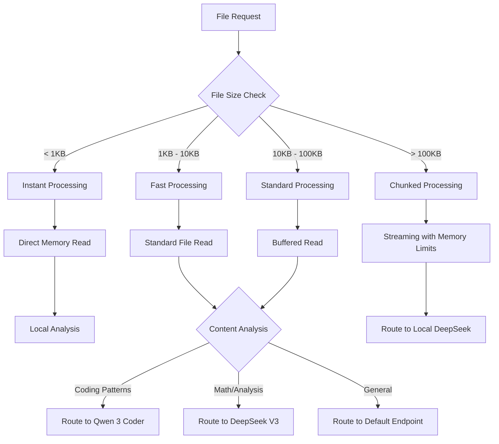

# File Access Architecture - DeepSeek MCP Bridge

## 🏗️ Architecture Overview

The DeepSeek MCP Bridge implements a sophisticated file access architecture designed for enterprise-grade performance, security, and cross-platform compatibility. The system uses intelligent file size routing, concurrent processing, and advanced security validation.

## 📊 Smart File Size Routing

### Routing Decision Tree



### File Size Categories

#### **Instant Processing** (<1KB)
- **Timeout**: 1 second maximum
- **Memory Usage**: Direct memory allocation
- **Performance Target**: <1ms processing time
- **Use Cases**: Configuration files, small JSON configs, environment variables

#### **Fast Processing** (1KB-10KB)
- **Timeout**: 3 seconds maximum  
- **Memory Usage**: Standard buffer allocation
- **Performance Target**: <100ms processing time
- **Use Cases**: Component files, utility functions, small modules

#### **Standard Processing** (10KB-100KB)  
- **Timeout**: 5 seconds maximum
- **Memory Usage**: Buffered read with optimization
- **Performance Target**: <500ms processing time
- **Use Cases**: Large components, documentation files, medium codebases

#### **Chunked Processing** (>100KB)
- **Timeout**: 10 seconds maximum per chunk
- **Memory Usage**: 50MB streaming limit with protection
- **Performance Target**: Progress tracking with chunked delivery
- **Use Cases**: Large log files, complete codebases, extensive documentation

## 🔐 Security Architecture

### Path Security Validation

#### **Path Traversal Protection**
```javascript
// Blocked patterns:
const dangerousPatterns = [
  /\.\.\//g,           // Directory traversal
  /\.\.\\/g,           // Windows directory traversal  
  /^\/etc\//,          // System directory access
  /^\/root\//,         // Root directory access
  /^C:\\Windows\\/,    // Windows system directory
];
```

#### **Malicious Content Detection**
```javascript
// Content scanning patterns:
const maliciousPatterns = [
  /eval\s*\(/,         // JavaScript eval injection
  /<script[^>]*>/i,    // Script tag injection
  /rm\s+-rf\s+\//,     // Dangerous shell commands
  /DROP\s+TABLE/i,     // SQL injection patterns
  /\$\{[^}]*\}/,       // Template injection
];
```

### File Access Permissions

#### **Read Permission Validation**
1. **File Existence Check**: Verify file exists and is accessible
2. **Permission Validation**: Ensure read permissions are granted
3. **File Type Validation**: Confirm file type matches expected patterns
4. **Size Limit Check**: Enforce maximum file size limits

#### **Security Boundaries**
```javascript
const securityConfig = {
  maxFileSize: 50 * 1024 * 1024,      // 50MB individual file limit
  maxBatchSize: 100 * 1024 * 1024,    // 100MB total batch limit
  allowedExtensions: [
    '.js', '.ts', '.py', '.java', '.cpp', '.c', '.h',
    '.json', '.xml', '.yaml', '.yml', '.md', '.txt',
    '.css', '.html', '.log'
  ],
  blockedPaths: [
    '/etc', '/root', '/sys', '/proc',
    'C:\\Windows', 'C:\\System32'
  ]
};
```

## 🖥️ Cross-Platform Compatibility

### Path Normalization

#### **Windows Support**
```javascript
// Automatic path conversion
const windowsPathNormalization = {
  backslashToForward: path => path.replace(/\\/g, '/'),
  driveLetterHandling: path => path.replace(/^([A-Z]):\//i, '/mnt/$1/'),
  wslPathTranslation: path => {
    if (path.startsWith('/mnt/c/')) {
      return path.replace('/mnt/c/', 'C:/');
    }
    return path;
  }
};
```

#### **Unix-like Systems (Linux/macOS)**
```javascript
// Standard Unix path handling
const unixPathNormalization = {
  homeDirectory: path => path.replace(/^~/, os.homedir()),
  relativePath: path => path.resolve(process.cwd(), path),
  symlinkResolution: path => fs.realpath(path)
};
```

### Environment Detection

```javascript
const platformDetection = {
  isWindows: process.platform === 'win32',
  isWSL: process.env.WSL_DISTRO_NAME !== undefined,
  isLinux: process.platform === 'linux' && !isWSL,
  isMacOS: process.platform === 'darwin',
  
  getOptimalEndpoint() {
    if (this.isWSL) return 'http://172.23.16.1:1234/v1';
    if (this.isWindows) return 'http://127.0.0.1:1234/v1';
    return 'http://localhost:1234/v1';
  }
};
```

## ⚡ Performance Optimization

### Concurrent Processing

#### **Batch Processing Strategy**
```javascript
const batchProcessing = {
  maxConcurrentFiles: 5,
  memoryThreshold: 50 * 1024 * 1024,  // 50MB
  
  determineBatchStrategy(fileCount, totalSize) {
    if (totalSize > 100 * 1024) {
      return 'local_endpoint_chunked';
    } else if (fileCount > 10) {
      return 'concurrent_limited';
    } else {
      return 'standard_parallel';
    }
  }
};
```

#### **Memory Management**
```javascript
const memoryManagement = {
  chunkSize: 64 * 1024,              // 64KB chunks
  maxMemoryUsage: 50 * 1024 * 1024,  // 50MB total limit
  gcThreshold: 0.8,                   // Trigger GC at 80% usage
  
  monitorMemoryUsage() {
    const usage = process.memoryUsage();
    if (usage.heapUsed / usage.heapTotal > this.gcThreshold) {
      global.gc && global.gc();
    }
  }
};
```

### Streaming Processing

#### **Large File Streaming**
```javascript
const streamingProcessor = {
  highWaterMark: 64 * 1024,  // 64KB buffer
  
  async processLargeFile(filePath, options = {}) {
    return new Promise((resolve, reject) => {
      const chunks = [];
      const stream = fs.createReadStream(filePath, {
        highWaterMark: this.highWaterMark,
        encoding: options.encoding || 'utf8'
      });
      
      stream.on('data', chunk => {
        chunks.push(chunk);
        this.updateProgress(chunks.length);
      });
      
      stream.on('end', () => {
        const content = options.encoding ? chunks.join('') : Buffer.concat(chunks);
        resolve(content);
      });
      
      stream.on('error', reject);
    });
  }
};
```

## 🔄 Intelligent Routing Integration

### Content-Based Routing

#### **Pattern Recognition**
```javascript
const routingPatterns = {
  codingPatterns: [
    /\bfunction\s+\w+\s*\(/,
    /\bclass\s+\w+/,
    /\bimport\s+.*\bfrom\b/,
    /\b(debug|implement|optimize|refactor)\b/i
  ],
  
  analysisPatterns: [
    /\b(analyze|analysis|calculate|statistics)\b/i,
    /\b(balance|metrics|research|strategy)\b/i,
    /\bmathematics?\b|\bequation\b|\bformula\b/i
  ],
  
  determineOptimalEndpoint(content, fileSize) {
    if (fileSize > 100 * 1024) return 'local';
    
    const contentLower = content.toLowerCase();
    
    if (this.analysisPatterns.some(p => p.test(contentLower))) {
      return 'nvidia_deepseek';
    }
    
    if (this.codingPatterns.some(p => p.test(contentLower))) {
      return 'nvidia_qwen';  
    }
    
    return 'nvidia_qwen'; // Default to coding expert
  }
};
```

### File Type Routing

```javascript
const fileTypeRouting = {
  analysisFiles: ['.md', '.txt', '.log', '.csv', '.json'],
  codingFiles: ['.js', '.ts', '.py', '.java', '.cpp', '.c'],
  configFiles: ['.json', '.yaml', '.yml', '.toml', '.ini'],
  
  getRoutingByExtension(filePath) {
    const ext = path.extname(filePath).toLowerCase();
    
    if (this.analysisFiles.includes(ext)) {
      return 'nvidia_deepseek';
    }
    
    if (this.codingFiles.includes(ext)) {
      return 'nvidia_qwen';
    }
    
    return 'auto'; // Use content analysis
  }
};
```

## 📈 Performance Monitoring

### Metrics Collection

#### **Processing Metrics**
```javascript
const performanceMetrics = {
  totalProcessed: 0,
  averageProcessingTime: 0,
  errorCount: 0,
  
  processingTimesBySize: {
    instant: [],    // <1KB files
    fast: [],       // 1KB-10KB files  
    standard: [],   // 10KB-100KB files
    chunked: []     // >100KB files
  },
  
  updateMetrics(processingTime, fileSize) {
    this.totalProcessed++;
    
    const newAvg = (this.averageProcessingTime * (this.totalProcessed - 1) + processingTime) / this.totalProcessed;
    this.averageProcessingTime = Math.round(newAvg);
    
    const sizeCategory = this.getFileSlizeCategory(fileSize);
    this.processingTimesBySize[sizeCategory].push(processingTime);
  }
};
```

#### **Health Monitoring**
```javascript
const healthMonitoring = {
  endpointHealth: {
    local: { status: 'unknown', lastCheck: null },
    nvidia_deepseek: { status: 'unknown', lastCheck: null },
    nvidia_qwen: { status: 'unknown', lastCheck: null }
  },
  
  async checkEndpointHealth(endpoint) {
    try {
      const startTime = Date.now();
      const response = await this.testEndpoint(endpoint);
      const responseTime = Date.now() - startTime;
      
      this.endpointHealth[endpoint] = {
        status: 'healthy',
        responseTime,
        lastCheck: new Date().toISOString()
      };
    } catch (error) {
      this.endpointHealth[endpoint] = {
        status: 'unhealthy', 
        error: error.message,
        lastCheck: new Date().toISOString()
      };
    }
  }
};
```

## 🛠️ Integration with MCP Tools

### File Analysis Tools

#### **analyze_files Integration**
```javascript
const analyzeFilesTool = {
  async processFileAnalysis(args) {
    const { files, analysis_type, output_format } = args;
    const fileProcessor = new FileProcessor();
    
    // Process files with intelligent routing
    const results = await fileProcessor.processBatch(files, {
      analysis_type,
      routing_strategy: 'intelligent'
    });
    
    // Route to appropriate AI based on file content and size
    for (const result of results.results) {
      const endpoint = this.selectEndpointForAnalysis(result);
      result.recommendedEndpoint = endpoint;
    }
    
    return this.formatAnalysisOutput(results, output_format);
  }
};
```

#### **youtu_agent_analyze_files Integration**
```javascript
const youtuAgentIntegration = {
  async processLargeFiles(args) {
    const { files, chunk_strategy, preserve_boundaries } = args;
    
    // Use chunked processing for large files
    const processor = new FileProcessor({ chunkSize: 32 * 1024 });
    const results = [];
    
    for (const filePath of files) {
      if (await this.requiresChunking(filePath)) {
        const chunks = await this.chunkFile(filePath, {
          strategy: chunk_strategy,
          preserveBoundaries: preserve_boundaries
        });
        
        results.push({
          filePath,
          chunks,
          processingStrategy: 'chunked',
          recommendedEndpoint: 'local' // Large files go to local
        });
      } else {
        // Use standard processing for smaller files
        const result = await processor.processFile(filePath);
        results.push(result);
      }
    }
    
    return { results, chunkingApplied: true };
  }
};
```

## 🚀 Usage Examples

### Basic File Analysis
```javascript
// Single file analysis with automatic routing
@analyze_files(
  files="src/components/GameInventory.js",
  analysis_type="performance_audit"
)
```

### Batch Processing with Pattern Filtering
```javascript
// Multiple files with intelligent batching
@analyze_files(
  files=["src/**/*.js", "config/*.json", "docs/*.md"],
  analysis_type="security_audit",
  output_format="detailed"
)
```

### Large File Processing
```javascript
// Large files with chunking
@youtu_agent_analyze_files(
  files=["logs/application.log", "database/schema.sql"],
  chunk_strategy="semantic",
  preserve_boundaries=true
)
```

### Cross-Platform Path Examples
```javascript
// Windows paths (automatically normalized)
@analyze_files(files="C:\\Users\\project\\src\\main.js")

// WSL paths  
@analyze_files(files="/mnt/c/project/src/main.js")

// Unix paths
@analyze_files(files="~/project/src/main.js")
```

---

## 🎯 Best Practices

### Performance Optimization
1. **Use Batch Processing**: Process multiple small files together
2. **Leverage Smart Routing**: Let the system choose optimal endpoints
3. **Monitor Memory Usage**: Keep an eye on large file processing
4. **Optimize File Patterns**: Use specific glob patterns to reduce processing

### Security Best Practices  
1. **Validate All Paths**: Always use the built-in path validation
2. **Check File Contents**: Review security warnings for suspicious content
3. **Limit File Sizes**: Stay within the 50MB individual file limit
4. **Monitor Access Patterns**: Watch for unusual file access requests

### Cross-Platform Development
1. **Use Forward Slashes**: Always use `/` in file paths, even on Windows  
2. **Test Path Resolution**: Verify paths work across different environments
3. **Handle Environment Variables**: Use proper environment detection
4. **Document Platform Differences**: Note any platform-specific behavior

---

*This file access architecture provides enterprise-grade security, performance, and compatibility while maintaining simplicity and ease of use.*